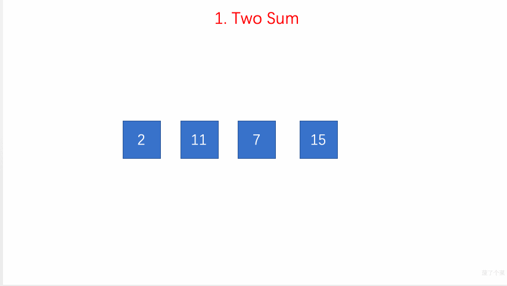

# Leetcode


[](https://developer.apple.com/)
[](https://developer.apple.com/)

[这里有中文版本的README，点击它！](https://github.com/MisterBooo/LeetCodeAnimation/blob/master/Readme.md)

I will do my best to demonstrate all the questions on LeetCode in the form of animation. 

I plan to take three to four years to complete it!

I look forward to witnessing this day with you!

The latest article published in WeChat **五分钟学算法** ,  you can pay attention to get the latest article.


## Problems

| ID   | Problem                                                      | Article                                                      | Animation                                                    | Date                        |
| ---- | ------------------------------------------------------------ | :----------------------------------------------------------- | :----------------------------------------------------------- | :-------------------------- |
| 000  | Ten Classic Sorting Algorithms                               | [十大经典排序算法动画与解析，看我就够了！（配代码完全版）](https://mp.weixin.qq.com/s/vn3KiV-ez79FmbZ36SX9lg) |  |                             |
| 001  | [Two-Sum](#1. Two-Sum)                                       | [每天一算：Two Sum](https://mp.weixin.qq.com/s?__biz=MzUyNjQxNjYyMg==&mid=2247483740&idx=1&sn=1950545589ea9b86ee65fbb6be1f4290&chksm=fa0e6eddcd79e7cb542b7d4dc1304eead516994315fa4f52b575230f0f022c9e0a88ede3714e&scene=21#wechat_redirect) |                                       |                             |
| 002  | [Add Two Numbers](#2. Add Two Numbers)                       | [图解LeetCode第 2 号问题：两个数字相加](https://mp.weixin.qq.com/s?__biz=MzUyNjQxNjYyMg==&mid=2247484231&idx=2&sn=6a9eb4fd0619c822e4dede69b8d841c8&chksm=fa0e6cc6cd79e5d0c03fffcd65b665fed62db9dca9c97771898f388ea292ce806bfd6eb908b5&token=934487935&lang=zh_CN#rd) |                               |                             |
| 003  | [Longest Substring Without Repeating Characters](#3. Longest Substring Without Repeating Characters) | [图解LeetCode第 3 号问题：无重复字符的最长子串](https://mp.weixin.qq.com/s?__biz=MzUyNjQxNjYyMg==&mid=2247484265&idx=2&sn=7f72afb341865923315bd51e1f50beff&chksm=fa0e6ce8cd79e5fe4be925fd5f01f59f59010c6c965fb3daefac79992593a6e58990c212e0bb&token=1412967663&lang=zh_CN#rd) |                               |                             |
| 019  | [Remove Nth Node From End of List](#19. Remove Nth Node From End of List) | [每天一算：Remove Nth Node From End of List](http://mp.weixin.qq.com/s?__biz=MzUyNjQxNjYyMg==&mid=2247483821&idx=1&sn=11ecccab76cd53163e9dedb75effeb93&chksm=fa0e6e2ccd79e73ae9137c0d91b3533df4ea4ead4ad081834b8d91ff364c0d55c350ddcfa6c4&scene=21#wechat_redirect) |                                             |                             |
| 020  | [Valid Parentheses](#20. Valid Parentheses)                  | [每天一算：Valid Parentheses](http://mp.weixin.qq.com/s?__biz=MzUyNjQxNjYyMg==&mid=2247483824&idx=1&sn=ab9362e125dc5e2b3ef1611cad9448c2&chksm=fa0e6e31cd79e727c6e1e0e3c467e193edb6ae841a41e5dc8eef39d0bf3141cc53f63b019cba&scene=21#wechat_redirect) |  |                             |
| 024  | Swap-Nodes-in-Pairs                                          | [每天一算：Swap Nodes in Pairs](http://mp.weixin.qq.com/s?__biz=MzUyNjQxNjYyMg==&mid=2247483773&idx=1&sn=db6cf272df968cd6571eb0bb50ecc721&chksm=fa0e6efccd79e7ea26810d335e6ece9ac23b8e3ac31be00dbd534018737ccb3ef9a00f22aff3&scene=21#wechat_redirect) |  |                             |
| 026  | Remove-Duplicates-from-Sorted-Array                          | [图解LeetCode第 26 号问题：删除排序数组中的重复项](https://mp.weixin.qq.com/s?__biz=MzUyNjQxNjYyMg==&mid=2247484284&idx=2&sn=c8af62a82a62a21217d0f0b2b5891e4f&chksm=fa0e6cfdcd79e5ebe8726a61f93b834467d29b7d9e60a44feb990388f9e98605ac1e3f7e723d&token=762342620&lang=zh_CN#rd) |  |                             |
| 075  | Sort-Colors                                                  | [每天一算：Sort Colors](http://mp.weixin.qq.com/s?__biz=MzUyNjQxNjYyMg==&mid=2247483706&idx=1&sn=905f43c882a91b55fd169d812620f277&chksm=fa0e6ebbcd79e7ad8857b0dad9ad14dbaf17fe557ef56ba600cec26b2bb668df2e171431d74c&scene=21#wechat_redirect) |  |                             |
| 086  | Partition-List                                               | [每天一算：Partition List](http://mp.weixin.qq.com/s?__biz=MzUyNjQxNjYyMg==&mid=2247483781&idx=1&sn=f31548ebbb2cf9ba56d979d3e51ddde2&chksm=fa0e6e04cd79e712d6cc7ff8e8b7631b7300ac0fa1a3e4c4e3b836de7a01fb5d0d6428a18bc4&scene=21#wechat_redirect) |  |                             |
| 092  | Reverse-Linked-List-II                                       | [每天一算：Reverse Linked List II](http://mp.weixin.qq.com/s?__biz=MzUyNjQxNjYyMg==&mid=2247483820&idx=1&sn=113e87b55c8ac8e22e9db00673798118&chksm=fa0e6e2dcd79e73b5835a262599b935783de3317a453bc0ed8df9fa5d1532785a085ea663e59&scene=21#wechat_redirect) |  |                             |
| 094  | Binary-Tree-Inorder-Traversal                                | [每天一算：Binary Tree Inorder Traversal ](http://mp.weixin.qq.com/s?__biz=MzUyNjQxNjYyMg==&mid=2247483853&idx=1&sn=94cd4b4ee8dc2268290a72334c6af57b&chksm=fa0e6e4ccd79e75a41a6b78397b80cdfccda332823874475b516f997f89e786488599fc5cc1e&scene=21#wechat_redirect) |  |                             |
| 102  | Binary-Tree-Level-Order-Traversal                            | [每天一算：Binary Tree Level Order Traveral](http://mp.weixin.qq.com/s?__biz=MzUyNjQxNjYyMg==&mid=2247483868&idx=1&sn=d50041789fcd13a75a2296f620b69d71&chksm=fa0e6e5dcd79e74b0030ac5129f10ec4ba87c98da63c5904affe9f06e06ecf28695c410d3ec7&scene=21#wechat_redirect) |  |                             |
| 103  | Binary Tree Zigzag Level Order Traversal                     | [图解LeetCode第 103 号问题：二叉树的锯齿形层次遍历](https://mp.weixin.qq.com/s?__biz=MzUyNjQxNjYyMg==&mid=2247484290&idx=2&sn=c29c4eefcbe8954cca6b3c8491ebccf1&chksm=fa0e6c03cd79e515581905322a3a22a3f3d10d24ca668a9d5aaef00932f0237eeaeaf3199668&token=1840661183&lang=zh_CN#rd) |  |                             |
| 107  | Binary Tree Level Order Traversal II                         | 每天一算： Binary Tree Level Order Traversal II              |  |                             |
| 136  | Single Number                                                | [一道让你拍案叫绝的算法题 ](https://mp.weixin.qq.com/s?__biz=MzUyNjQxNjYyMg==&mid=2247484505&idx=1&sn=4c1c056dd4852c3b4b1ead51c90a9b2d&chksm=fa0e6bd8cd79e2ce8188dcdd8843a5d071248906bfb8971c62d513dbd69b816acc191a78e4b2&token=487128715&lang=zh_CN#rd) |  | 2019-01-16                  |
| 144  | Binary-Tree-Preorder-Traversal                               | [每天一算：Binary Tree Preorder Traversal](http://mp.weixin.qq.com/s?__biz=MzUyNjQxNjYyMg==&mid=2247483843&idx=1&sn=994bf0d42dd9941a879a3a3ed500a4d6&chksm=fa0e6e42cd79e75472404eb5da7ee98f20d303efe230eb4f41efec57164630f555e7111e62ff&scene=21#wechat_redirect) |  |                             |
| 145  | Binary-Tree-Postorder-Traversal                              | [每天一算：Binary Tree Postorder Traversal](http://mp.weixin.qq.com/s?__biz=MzUyNjQxNjYyMg==&mid=2247483853&idx=1&sn=94cd4b4ee8dc2268290a72334c6af57b&chksm=fa0e6e4ccd79e75a41a6b78397b80cdfccda332823874475b516f997f89e786488599fc5cc1e&scene=21#wechat_redirect) |  |                             |
| 146  | LRU Cache                                                    | LRU缓存机制                                                  |  | 2019-01-25 Made by Jun chen |
| 150  | Evaluate-Reverse-Polish-Notation                             | [每天一算：Evaluate Reverse Polish Notation](http://mp.weixin.qq.com/s?__biz=MzUyNjQxNjYyMg==&mid=2247483834&idx=1&sn=27cbff99f10dfcdb56cb37c237d7f2bb&chksm=fa0e6e3bcd79e72dc430bf81aed9dde9bd01634239dcf7820d6befa881efd323d9d58d76d90d&scene=21#wechat_redirect) |  |                             |
| 167  | Two-Sum-II-Input-array-is-sorted                             | [每天一算：Two Sum II ](http://mp.weixin.qq.com/s?__biz=MzUyNjQxNjYyMg==&mid=2247483711&idx=1&sn=3afec74e9e9effa71dc0b22659e14b44&chksm=fa0e6ebecd79e7a84db7861c9b5dbccdc98aa9d9a6994dda49a37edeb729e8242ea6af8f20ad&scene=21#wechat_redirect) |  |                             |
| 199  | Binary Tree Right Side View                                  | 每天一算：Binary Tree Right Side View                        |  |                             |
| 203  | Remove-Linked-List-Elements                                  | [每天一算：Remove Linked List Elements](http://mp.weixin.qq.com/s?__biz=MzUyNjQxNjYyMg==&mid=2247483766&idx=1&sn=6721376a65680bf7cf9064cf7b1ae4ae&chksm=fa0e6ef7cd79e7e1665e60fe6ea3f2087bca518c1573bc4c4b9425573f98401bafc59542dca0&scene=21#wechat_redirect) |  |                             |
| 206  | Reverse Linked List                                          | [每天一算： Reverse Linked List ](http://mp.weixin.qq.com/s?__biz=MzUyNjQxNjYyMg==&mid=2247483799&idx=1&sn=c2212c8963809e8d3392abeeb851dbfc&chksm=fa0e6e16cd79e7003c2d30b1a2bb4f23dc56df38e3efedd0ab2cfae291609280a832eabe67de&scene=21#wechat_redirect) |  |                             |
| 209  | Minimum Size Subarray Sum                                    | 每天一算： Minimum Size Subarray Sum                         |  |                             |
| 219  | Contains-Duplicate-II                                        | [每天一算：Contains Duplicate II  ](http://mp.weixin.qq.com/s?__biz=MzUyNjQxNjYyMg==&mid=2247483755&idx=1&sn=2501b6ca09c43eaa9fba71a9bd1f5253&chksm=fa0e6eeacd79e7fc192c0a23cf90d98fe6f2c35f9e4f2d0f937ccba45a58cf23a0a9c49d35d5&scene=21#wechat_redirect) |  |                             |
| 237  | Delete-Node-in-a-Linked-List                                 | 每天一算：Delete Node in a Linked List                       |  |                             |
| 279  | Perfect Squares                                              | [图解LeetCode第 279 号问题： 完全平方数](https://mp.weixin.qq.com/s/53AlHe29fJF1hEwj0cj7ZA) |  | Made by 王琛 2019-01-19日   |
| 283  | Move-Zeroes                                                  | [每天一算：Move Zeros](http://mp.weixin.qq.com/s?__biz=MzUyNjQxNjYyMg==&mid=2247483700&idx=1&sn=465f778d60e8560742feab5844d7cac5&chksm=fa0e6eb5cd79e7a357899d378edb532b498cd63e3ce9113f8ac74d397ce4b214ca5aa8198b7d&scene=21#wechat_redirect) |  |                             |
| 328  | Odd-Even-Linked-List                                         | [每天一算：Odd Even Linked List](http://mp.weixin.qq.com/s?__biz=MzUyNjQxNjYyMg==&mid=2247483786&idx=1&sn=f7810950b34675e1c4420361faf5e361&chksm=fa0e6e0bcd79e71d2c6fc6a4a68b6ef7a17abc3dc9897548f8e44b51e9494f52c4cebbc4176e&scene=21#wechat_redirect) |  |                             |
| 344  | Reverse-String                                               | 每天一算：Reverse String                                     |  |                             |
| 349  | Intersection-of-Two-Arrays                                   | [每天一算：Intersection of Two Arrays ](http://mp.weixin.qq.com/s?__biz=MzUyNjQxNjYyMg==&mid=2247483726&idx=1&sn=a887f6b983058d97c183dd300832ecbb&chksm=fa0e6ecfcd79e7d985587b543622c85aadc83a4d7a074135e1356fb4a0ebfd07e7af13467906&scene=21#wechat_redirect) |  |                             |
| 350  | Intersection-of-Two-Arrays-II                                | [每天一算：Intersection of Two Arrays II ](http://mp.weixin.qq.com/s?__biz=MzUyNjQxNjYyMg==&mid=2247483733&idx=1&sn=946bd6de3251437dd77b43ecab056c82&chksm=fa0e6ed4cd79e7c2a439b5f1853bf5154a3438ed282c7ba5e94948780c426a1f1492c0b201c4&scene=21#wechat_redirect) |  |                             |
| 445  | Add Two Numbers II                                           | [图解LeetCode第 445 号问题：  两数相加 II](https://mp.weixin.qq.com/s/z8_1dK7mw9gxfhhSZUBVgg) |  | Made by 王琛 2019-01-19日   |
| 447  | Number-of-Boomerangs                                         | [每日一算：Number of Boomerangs](http://mp.weixin.qq.com/s?__biz=MzUyNjQxNjYyMg==&mid=2247483747&idx=1&sn=7774eee0b252b311257134f6a52c4e2d&chksm=fa0e6ee2cd79e7f44858c46c3d04859ced9073dbb9de95ce7ee0bcc131e613862ddfd9a6f158&scene=21#wechat_redirect) |  |                             |
| 454  | 4Sum-II                                                      | 每日一算：4Sum II                                            |  |                             |
| 642  | Design Search Autocomplete System                            | [图解 LeetCode 第 642 号问题：搜索自动完成系统](https://mp.weixin.qq.com/s?__biz=MzUyNjQxNjYyMg==&mid=2247484491&idx=1&sn=b329d90370d183b5a58bbf03f6a436ae&chksm=fa0e6bcacd79e2dc05bb5eaabd888561b82c37700b511e4971aa76ec42a630c0a35ef3e4721b&token=397665543&lang=zh_CN#rd) | Made by Jun [Click here](https://mp.weixin.qq.com/s?__biz=MzUyNjQxNjYyMg==&mid=2247484491&idx=1&sn=b329d90370d183b5a58bbf03f6a436ae&chksm=fa0e6bcacd79e2dc05bb5eaabd888561b82c37700b511e4971aa76ec42a630c0a35ef3e4721b&token=397665543&lang=zh_CN#rd) |                             |

If the link of the article cannot be clicked, it means that the article has not been published. Please look forward to it :)

## Code source 

This warehouse code unless otherwise specified, all from this warehouse 

[Play-Leetcode](https://github.com/liuyubobobo/Play-Leetcode)

## Implement

### 1. Two-Sum


leetcode上第1号问题：Two Sum

> 给定一个整数数组和一个目标值，找出数组中和为目标值的两个数。
>
> 你可以假设每个输入只对应一种答案，且同样的元素不能被重复利用。
>
> 示例:
>
> 给定 nums = [2, 7, 11, 15], target = 9
>
> 因为 nums[0] + nums[1] = 2 + 7 = 9  
> 所以返回 [0, 1]

#### 思路

使用查找表来解决该问题。

> 设置一个map容器record用来记录元素的值与索引
>
> 遍历数组nums
>
> - 每次遍历时使用临时变量complement用来保存目标值与当前值的差值
> - 在此次遍历中查找record，查看是否有与complement一致的值，如果查找成功则返回查找值的索引值与当前变量的值i
> - 如果未找到，则在record保存该元素与索引值 i

```java
public class Solution {
    public int[] twoSum(int[] nums, int target) {
        HashMap<Integer, Integer> m = new HashMap<Integer, Integer>();
        int[] res = new int[2];
        for (int i = 0; i < nums.length; ++i) {
            if (m.containsKey(target - nums[i])) {
                res[1] = i;
                res[0] = m.get(target - nums[i]);
                break;
            }
            m.put(nums[i], i);
        }
        return res;
    }
}
```

### 2. Add Two Numbers


**链表简介:**

- 单链表中的每个结点不仅包含值，**还包含链接到下一个结点的引用字段**。


- 与数组不同，我们无法在常量时间内访问单链表中的随机元素。

  如果我们想要获得第 i 个元素，我们**必须从头结点逐个遍历**。 我们按索引来访问元素平均要花费 O(N) 时间，其中 N 是链表的长度。

- 如果我们想在给定的结点 prev 之后添加新值，我们应该：

  - 使用给定值初始化新结点 cur；
  - 将 cur 的“next”字段链接到 prev 的下一个结点 next；
  - 将 prev 中的“next”字段链接到 cur 。

  与数组不同，我们**不需要将所有元素移动到插入元素之后**,因此，您可以在 O(1) 时间复杂度中将新结点插入到链表中，这非常高效。

- 如果我们想从单链表中删除现有结点 cur，可以分两步完成：

  - 找到 cur 的上一个结点 prev 及其下一个结点 next；
  - 接下来链接 prev 到 cur 的下一个节点 next。
  - 第一步中，我们需要找出 prev 和 next。使用 cur 的参考字段很容易找出 next，但是，我们必须从头结点遍历链表，以找出 prev，它的平均时间是 O(N)，其中 N 是链表的长度。因此，删除结点的时间复杂度将是 O(N)。
  - 空间复杂度为 O(1)，因为我们只需要常量空间来存储指针。

- 设计链表的实现。您可以选择使用单链表或双链表。

  ==单链表中的节点应该具有两个属性：val 和 next==。 

  - val 是当前节点的值

- - next 是指向下一个节点的指针/引用

如果要使用==双向链表==，则还需要一个属性 prev 以指示链表中的上一个节点。假设链表中的所有节点都是 0-index 的


- get(index)：获取链表中第 index 个节点的值。如果索引无效，则返回-1。
- addAtHead(val)：在链表的第一个元素之前添加一个值为 val 的节点。插入后，新节点将成为链表的第一个节点。
- addAtTail(val)：将值为 val 的节点追加到链表的最后一个元素。
- addAtIndex(index,val)：在链表中的第 index 个节点之前添加值为 val  的节点。如果 index 等于链表的长度，则该节点将附加到链表的末尾。如果 index 大于链表长度，则不会插入节点。
- deleteAtIndex(index)：如果索引 index 有效，则删除链表中的第 index 个节点


```java
/**
 * Definition for singly-linked list.
 * public class ListNode {
 *     int val;
 *     ListNode next;
 *     ListNode(int x) { val = x; }
 * }
 */
public class Solution {
    public ListNode addTwoNumbers(ListNode l1, ListNode l2) {
        //生成ListNode链表对象，链表的值为0，没有指向的节点
        ListNode dummy = new ListNode(-1);
        ListNode cur = dummy;//link to head
        int carry = 0;
        while (l1 != null || l2 != null) {
            int d1 = l1 == null ? 0 : l1.val;
            int d2 = l2 == null ? 0 : l2.val;
            int sum = d1 + d2 + carry;
            carry = sum >= 10 ? 1 : 0;
            cur.next = new ListNode(sum % 10);
            cur = cur.next;
            if (l1 != null) l1 = l1.next;
            if (l2 != null) l2 = l2.next;
        }
        if (carry == 1) cur.next = new ListNode(1);
        return dummy.next;
    }
}
```

注：

- 不要把ListNode写成ListNote;
- 创建list need creat a head at first,then return this head.
- 创建一个dummyHead以后记得指向下一个节点。且返回要返回dummyHead.next，不要返回开头的空节点

### 3. Longest Substring Without Repeating Characters

- 

```java
class Solution {
    public int lengthOfLongestSubstring(String s) {
        int maxIdx = 0, res = 0;
        HashMap<Character,Integer> map = new HashMap<>();
        for (int i = 0; i < s.length(); i++) {
            if(map.containsKey(s.charAt(i))){
                maxIdx = Math.max(map.get(s.charAt(i)),maxIdx);
            }
            res = Math.max(i - maxIdx + 1,res);
            map.put(s.charAt(i),i+1);
        }
        return res;
    }
}
```

### 4. Median of Two Sorted Arrays


### 19. Remove Nth Node From End of List


#### 解题思路

采取双重遍历肯定是可以解决问题的，但题目要求我们一次遍历解决问题，那我们的思路得发散一下。

我们可以设想假设设定了双指针`p`和`q`的话，当`q`指向末尾的`NULL`，`p`与`q`之间相隔的元素个数为`n`时，那么删除掉`p`的下一个指针就完成了要求。

- 设置虚拟节点`dummyHead`指向`head`
- 设定双指针`p`和`q`，初始都指向虚拟节点`dummyHead`
- 移动`q`，直到`p`与`q`之间相隔的元素个数为`n`
- 同时移动`p`与`q`，直到`q`指向的为`NULL`
- 将`p`的下一个节点指向下下个节点

注：

1. 链表是单向的，一旦先赋值，然后再遍历时指针指向哪里，链表就只有当前节点到之前赋值的节点那么长

2. 注意链表有初始化值，和没初始化值

   ```java
   ListNode dummy = new ListNode(0);
   dummy.next = head;  //dummy的首节点值为0，其next接了head
   ListNode first = head;//head的地址给了first，first没有初始化过值，其地址和head一样
   ```

3. 删除节点直接跳过即可

   ```java
   first.next = first.next.next;
   ```

4. 指针指向的地址修改过后，该地址的值也会改变

```java
class Solution {
    public ListNode removeNthFromEnd(ListNode head, int n) {
        ListNode dummyHead = new ListNode(0);
        ListNode p = dummyHead;
        ListNode q = dummyHead;
        p.next = head;

        int flag = 0;
        while (flag < n){
            flag++;
            q = q.next;
        }

        while (q.next != null){
            p = p.next;
            q = q.next;
        }
        p.next = p.next.next;//注意是p.next不是p=
        return dummyHead.next;
    }
}
```


### 20. Valid Parentheses


```java
//方法一
public boolean isValid(String s) {
        HashMap<Character,Character> map = new HashMap<>();
        Stack<Character> stack = new Stack<>();
        boolean flag = false;
        map.put(')','(');
        map.put(']','[');
        map.put('}','{');

        for (int i = 0; i < s.length(); i++) {
            if(stack.contains(s.charAt(i)) == true || stack.contains(map.get(s.charAt(i))) == false){
                    stack.push(s.charAt(i));
            }

            if(stack.peek() == map.get(s.charAt(i))){
                stack.pop();
            }
        }
        flag = stack.isEmpty()? true:false;

        return flag;
    }
//方法二
    public boolean isValid(String s) {
        Stack<Character> stack = new Stack<>();
        boolean flag = false;

        char match;
        for (int i = 0; i < s.length(); i++) {
            if(s.charAt(i) == ')'){
                match = '(';
            }else if(s.charAt(i) == ']'){
                match = '[';
            }else if(s.charAt(i) == '}'){
                match = '{';
            }else {
                match = '0';
            }

            if(stack.contains(s.charAt(i)) == true || stack.contains(match)==false){
                stack.push(s.charAt(i));
            }

            if(stack.peek() == match){
                stack.pop();
            }
        }
        flag = stack.isEmpty()? true:false;
        return flag;
    }
```

